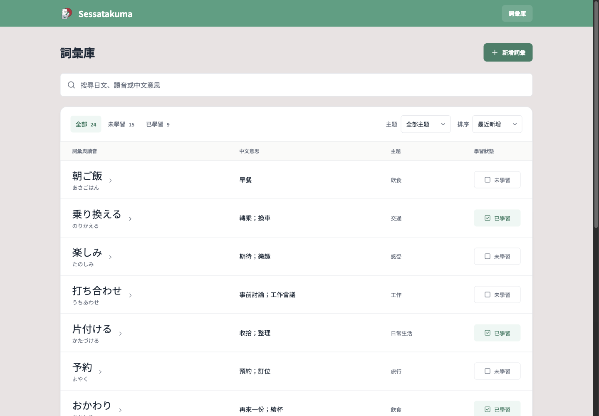
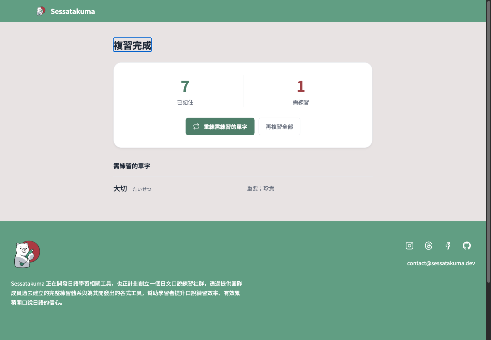
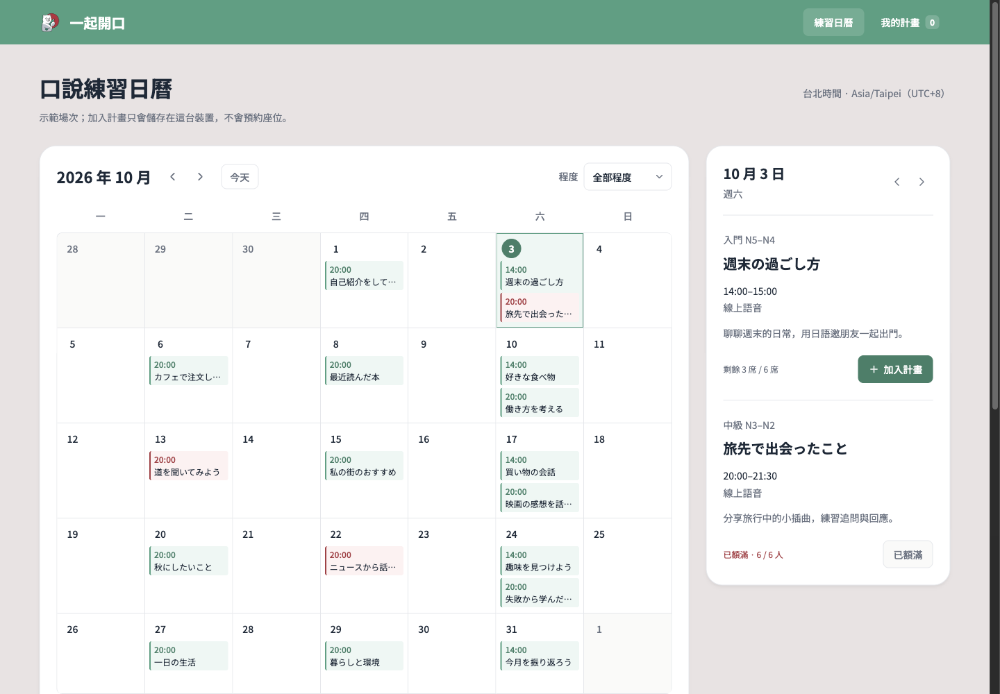
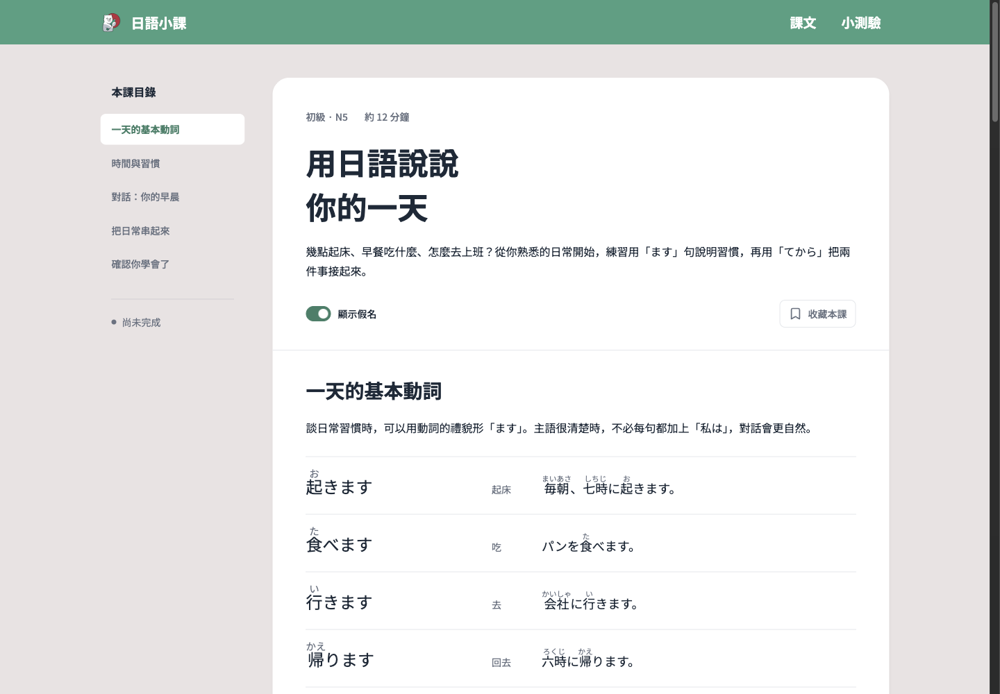
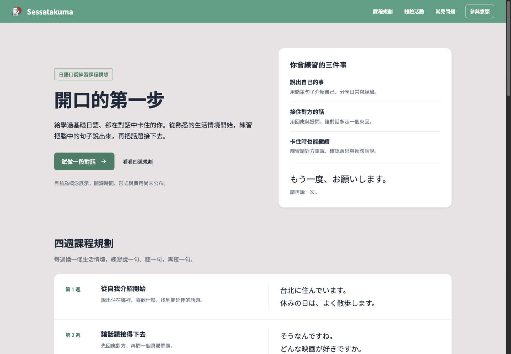
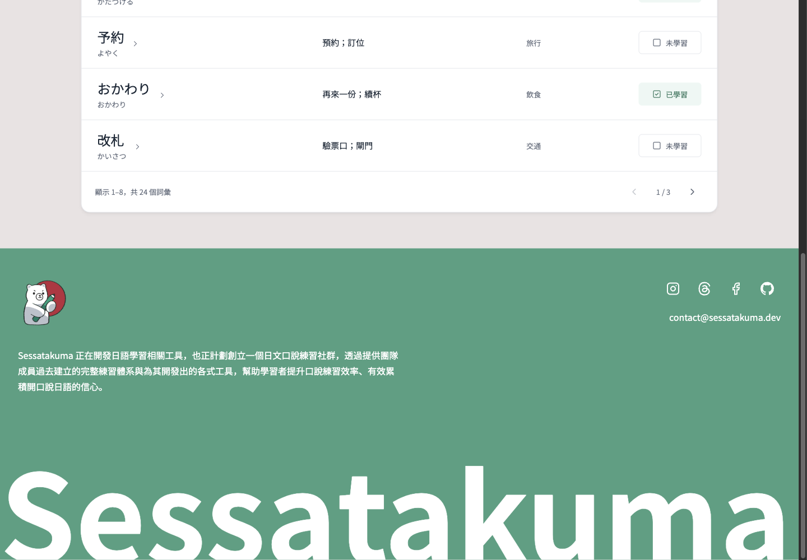
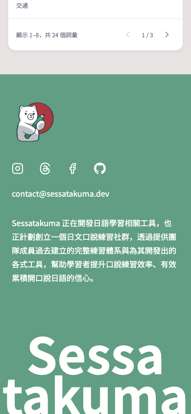

# Product showcase

Five independent builders used the same frozen guide and brand assets, with different functional briefs. These are reviewed Chromium captures of the unchanged version 10 prototypes, with local state and sample content. They illustrate flexible task layouts within the shared visual language.

## Vocabulary library

## Focused flashcards

## Community calendar

## Lesson reader

## Public course page

## Complete shared footer

The same bear, social marks, email, purpose paragraph and wordmark appear across all five products. Narrow layouts retain the content and can wrap the contact group.

[Calibration results and scope](design-calibration.md) record the 15 standard-size reviews, 320px contact checks and representative interactions. The [raw manifest](calibration/review-v10.json) preserves the original local capture paths and measurements; the complete local archive is larger than this selected showcase.
